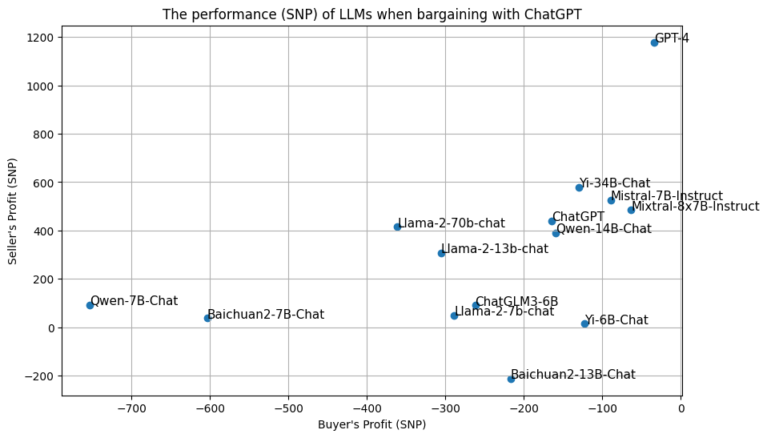
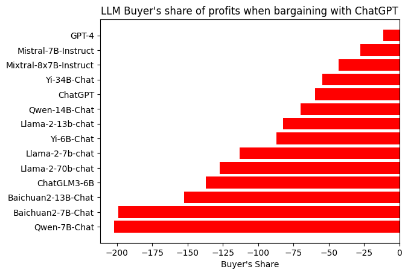
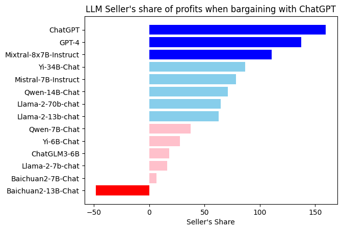
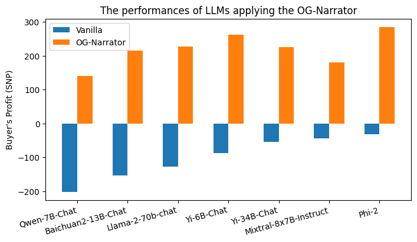

This is the official repository of our paper [Measuring Bargaining Abilities of LLMs: A Benchmark and A Buyer-Enhancement Method](https://arxiv.org/abs/2402.15813).

# Abstract
Bargaining is an important and unique part of negotiation between humans. As LLM-driven agents learn to negotiate and act like real humans, how to evaluate agents' bargaining abilities remains an open problem.

For the first time, we formally described the Bargaining task as an asymmetric incomplete information game, defining the gains of the Buyer and Seller in multiple bargaining processes. It allows us to quantitatively assess an agent's performance in the Bargain task.

We collected a real product price dataset, *AmazonHistoryPrice*, and conducted evaluations of various LLM agents' bargaining abilities. We find that playing a Buyer is much harder than a Seller, and increasing model size can not effectively improve the Buyer's performance.

To address the challenge, we propose a novel approach called OG-Narrator that integrates a deterministic Offer Generator to control the price range of Buyer's offers, and an LLM Narrator to create natural language sentences for generated offers.

Experimental results show that OG-Narrator improves the buyer's deal rates from 26.67\% to 88.88\% and brings a ten times of multiplication of profits on all baselines, even a model that has not been aligned.

# Dataset
*AmazonHistoryPrice* is in the `data/AmazonHistoryPrice` folder. We provided the `dataset_analysis/analyse.py` to examine the dataset.

# Running Benchmarks
0. `pip install openai vllm jsonlines fire matplotlib pandas seaborn`
1. fill all your keys into "openai_keys" in api_settings.py.
2. `source start_vllm_server.sh $YOUR_MODEL_DIR $YOUR_GPU_NUM` to start a vllm server that runs your model. 
(For example, `source start_vllm_server.sh ../models/Llama-2-70b-chat-hf 4`). By default, it runs at half precision.
3. `source run_2stages.sh $MODEL_NAME ./results $EXPERIMENTS_NAME` will run the Buyer and Seller benchmarks for you. If you are interested in OGNarrator, you can replace the "run_2stages.sh" with "run_3stages.sh". The model name doesn't have to be exact.
(For example, `source run_3stages.sh llama-2-70b ./results run1-2024.1.1`).
4. after all tests are completed, `python eval.py ./results` will write all evaluation results into "./results/eval_results.csv". Also, the distributions of normalized profits are plotted in directories with the same names as the jsonl files.

# Benchmark Result
To better visualize the benchmark results, we drew the following image using `plot_pic.ipynb`.

